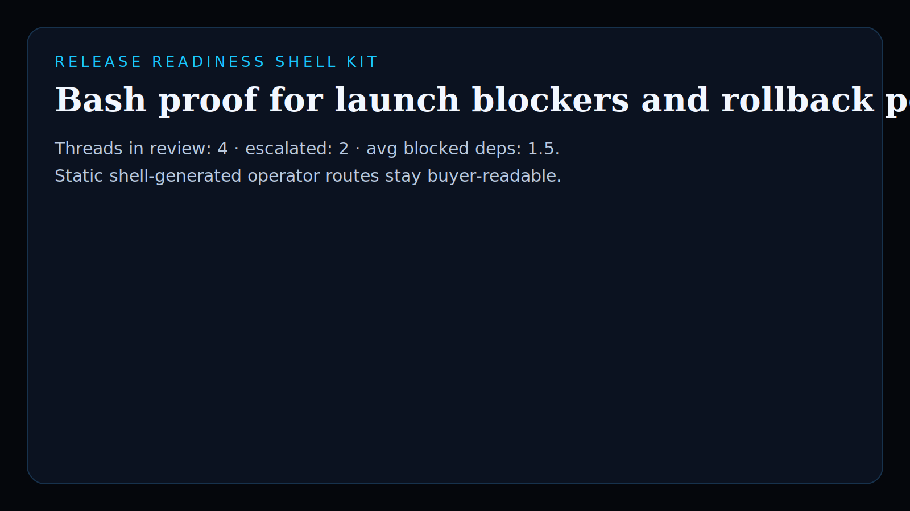
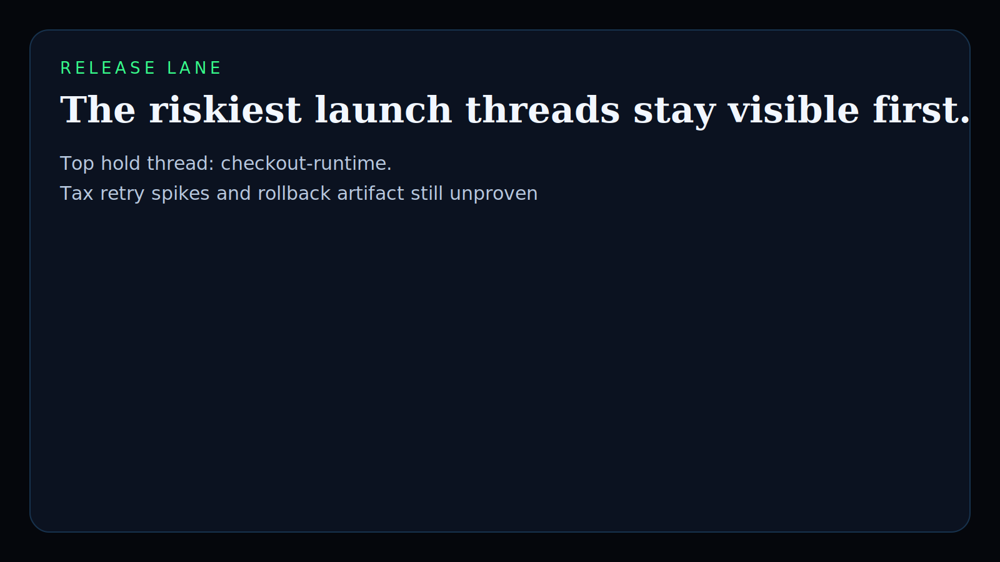
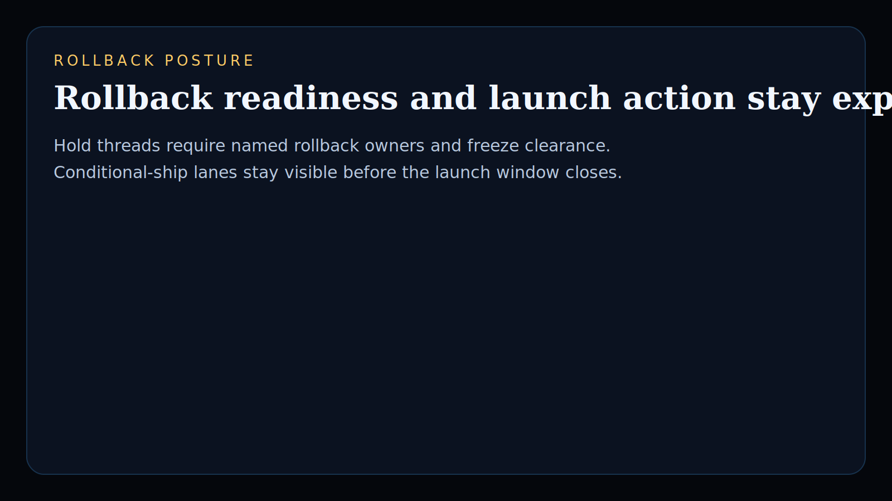
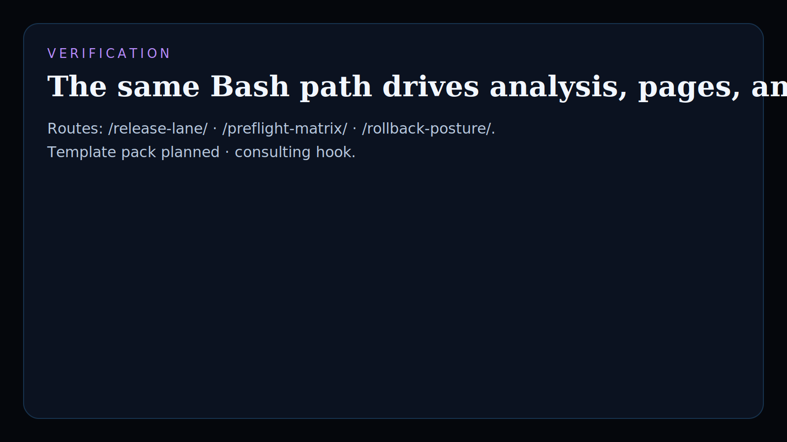

# release-readiness-shell-kit

Bash-native operator surface for Platform Engineering teams reviewing release windows, dependency blockers, rollback readiness, and freeze pressure before launch.

## What it shows

- real `Shell / Bash` added to the public Kinetic Gain language atlas
- platform-release decisioning that comes from shell analysis, not a mocked dashboard
- monetizable runbook kits, preflight templates, and embedded release-governance consulting hooks

## Screenshots






## Routes

- `/`
- `/release-lane/`
- `/preflight-matrix/`
- `/rollback-posture/`
- `/verification/`
- `/docs/`

## Local development

```powershell
& 'C:\Program Files\Git\bin\bash.exe' -lc "cd /c/Users/chaus/dev/repos/release-readiness-shell-kit && scripts/run_demo.sh"
& 'C:\Program Files\Git\bin\bash.exe' -lc "cd /c/Users/chaus/dev/repos/release-readiness-shell-kit && scripts/generate_site.sh"
```

## Validation

```powershell
& 'C:\Program Files\Git\bin\bash.exe' -lc "cd /c/Users/chaus/dev/repos/release-readiness-shell-kit && test/runtests.sh"
& 'C:\Program Files\Git\bin\bash.exe' -lc "cd /c/Users/chaus/dev/repos/release-readiness-shell-kit && scripts/smoke_check.sh"
& 'C:\Program Files\Git\bin\bash.exe' -lc "cd /c/Users/chaus/dev/repos/release-readiness-shell-kit && scripts/render_readme_assets.sh"
```

## Why this matters

Kinetic Gain Embedded tie-back:

This repo proves Kinetic Gain can ship buyer-readable release governance and preflight logic directly from Bash. The language-atlas signal is real: analyze launch pressure, publish operator routes, and keep the same surface usable for runbook kits and embedded platform work.

## Commercial path

- `Template pack planned`
- `Consulting hook`

This can ladder into release preflight packs, rollback drills, freeze-window runbooks, and embedded launch-governance work for platform teams.

---

Part of the [Kinetic Gain operator portfolio](https://kineticgain.com/) · docs: [suite.kineticgain.com](https://suite.kineticgain.com/) · live: [release.kineticgain.com](https://release.kineticgain.com/)

